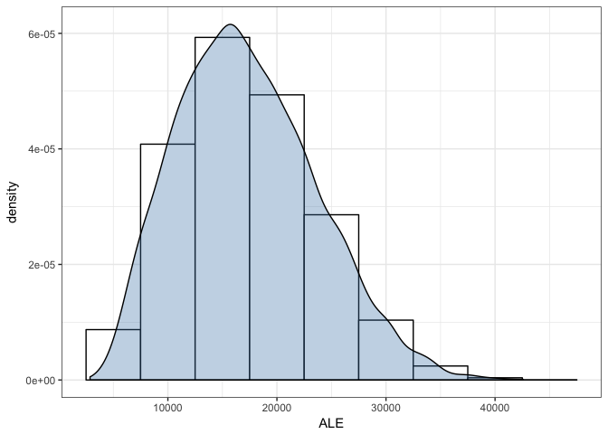
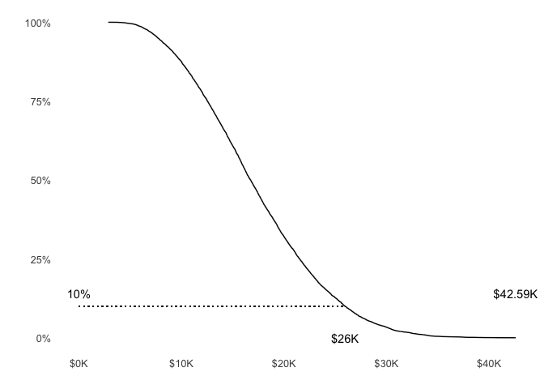

Example FAIR analysis
================

This is an example of a risk analysis using the FAIR model implemented
in an [R Markdown](http://rmarkdown.rstudio.com) Notebook. When you
execute code within the notebook, the results appear beneath the code.

## Estimates from Subject Matter Experts

Estimates should be
[calibrated](https://en.wikipedia.org/wiki/Calibrated_probability_assessment).
There are [good courses
available](https://www.hubbardresearch.com/shop/calibration-facilitator-training/)
on calibrating your subject matter experts.

Estimates are all provided as a range of min, max, and most likely. For
advanced analysis, you can also [tweak the confidence
factor](https://www.vosesoftware.com/riskwiki/ModifiedPERTdistribution.php)
to adjust the shape of the distribution.

## Set up inputs for Loss Event Frequency

If loss event freqency cannot be estimated, then go a level deeper in
the FAIR model and derive loss event frequency from Threat Event
Frequency and Vulnerability (susceptibility). For the purpose of this
example we will estimate Loss Event Frequency directly.

We are estimating that this loss occurs at least twice a year, is most
likely to happen 4 times a year (once per quarter), and at most would
occur 9 times per year.

``` r
loss_event_frequency_min <- 2
loss_event_frequency_max <- 9
loss_event_frequency_likely <- 4
```

## Set up inputs for Loss Magnitude

Losses in FAIR are divided into primary losses and secondary losses.
Another term for this is guaranteed losses and conditional losses.
Primary losses are typically where we put losses incurred directly by
the organization, Secondary losses are typically where we put losses
that are caused by actions that secondary stakeholders might take. If a
secondary loss always occurs, there is no math reason for categorizing
as a secondary loss.

Losses in FAIR are divided into 6 forms, to help structure the
discussion with your subject matter experts. All the forms of loss get
added together, but dividing them in this way helps organize the
calculations.

The 6 forms of loss in FAIR are

  - Productivity Loss - lost sales, idle employees
  - Response costs - hiring lawyers, forensic investigations, generators
  - Replacement costs
  - Competitive Advantage
  - Fines/Judgements
  - Reputation Damage - examples are uncaptured revenue, increased cost
    of capital

In this example we will not calculate each form of loss separately, but
assume that we have considered each of those forms and come up with a
range estimate of loss magnitude.

``` r
loss_magnitude_min <- 1000
loss_magnitude_max <- 9000
loss_magnitude_likely <- 4000
```

## Run the calculations

``` r
confidence <- 4 # default in PERT
number_of_runs <- 10000
```

We do a [monte carlo simulation using the beta-PERT
distribution](https://www.rdocumentation.org/packages/mc2d/versions/0.1-17/topics/pert).
Defaulting to 10,000 runs. Confidence level of 4 is the default in
beta-PERT, we can vary this value to change the shape of the
distribution to reflect lower or higher certainty around the most likely
value.

For a nice explanation of how this code works in R, see this explanation
[of betaPERT by Jay
Jacobs](http://datadrivensecurity.info/blog/posts/2014/Jan/severski/)

Set a seed for repeatable results in this notebook

``` r
set.seed(88881111)
```

Run the simulation for the Loss Event
Frequency

``` r
LEF <- rpert(number_of_runs, loss_event_frequency_min, loss_event_frequency_likely, loss_event_frequency_max, shape = confidence)
```

Run the simulation for the Loss
Magnitude

``` r
LM <- rpert(number_of_runs, loss_magnitude_min, loss_magnitude_likely, loss_magnitude_max, shape = confidence)
```

Multiply Loss Event Frequency x Loss Magnitude. Note that in R this is
doing vector multiplication.

``` r
annual_loss_exposure <- LEF * LM
crude_ALE <- annual_loss_exposure
```

Simple vector multiplication as implied by the FAIR model assumes that
multiple losses in a single year are the same size, for a better
approach described at
[Severski](https://gist.github.com/davidski/8490758#gistcomment-2387996)
we can take each set of loss events in a year and sample from the
distribution of loss magnitudes, then
sum.

``` r
ALE <- sapply(LEF, function(e) sum(rpert(e, loss_magnitude_min, loss_magnitude_likely, loss_magnitude_max, shape = confidence)))
max_loss <- max(ALE)
min_loss <- min(ALE)
```

Take the 95th percentile for the first result. Value at Risk is
$40,123.11. Maximum Loss is $60,447.74. Mean Loss is $19,499.58. Minimum
Loss is $3,029.60.

Take the 95th percentile. Value at Risk is $30,648.46. Maximum Loss is
$42,587.60. Mean Loss is $17,292.94. Minimum Loss is $2,864.44.

## Histogram visualization

Plot the results to show annual loss exposure. This can be plotted as a
histogram or a loss exceedance curve with linear or exponential scales.

``` r
ale_frame <- data.frame(ALE)
most <- max(ALE)

gg <- ggplot(ale_frame, aes(x = ALE))
gg <- gg + geom_histogram(aes(y = ..density..),
                          color="black", 
                          fill = "white", 
                          binwidth = 5000)
gg <- gg + geom_density(fill = "steelblue", alpha = 1/3)
gg <- gg + theme_bw()
gg
```

<!-- -->

## Loss Exceedance curve

Lets look at the [loss exceedance
curve](https://www.cyentia.com/communicating-risk-loss-exceedance-curves/)
for these
results.

``` r
# calculate the probability of exceedance aka complementary cumulative probability function
ale_frame <- mutate(ale_frame, prob = 1 - percent_rank(ALE))
# sort the results in ascending order of loss magnitude
ale_frame <- ale_frame[order(ALE),]
g2 <- ggplot(ale_frame, mapping = aes(x = ALE, y = prob))
g2 <- g2 + geom_path() + scale_y_continuous(labels = percent)
#g2 <- g2 + geom_hline(yintercept = 0.1, color = "red", size = .5) +
#  scale_y_continuous(labels = percent)
  
g2 <- g2 + scale_x_continuous(labels = format_kdollars) # normal scale
#g2 <- g2 + scale_x_log10(labels = format_kdollars) # logarithmic scale
g2 <- g2 + annotate("text", y = 0.1, x = max(ALE), 
                    label = format_kdollars(max(ALE)), vjust = -1)
#g2 <- g2 + geom_hline(yintercept = 0.1, lty = "dotted")
#g2 <- g2 + geom_vline(xintercept = max(ale_frame$ALE), lty = "dotted")
g2 <- g2 + annotate("text", y = 0.10, x = 0, label = percent(0.1), vjust = -1)
g2 <- g2 + annotate("text", y = 0, x = quantile(ale_frame$ALE, c(0.90)), 
                    label = format_kdollars(round(quantile(ale_frame$ALE, c(0.90)), digits = -2)), hjust = 0.5)

g2 <- g2 + geom_segment(aes(x = 0, y = 0.1, xend = quantile(ale_frame$ALE, c(0.90)), yend = 0.1), lty = "dotted")
#           geom_point(data = intersection_xy_df, size = 3)
g2 + theme_few()
```

<!-- -->

## Notes

It’s important to note that this is not a prediction, but a calculation
of probabilities. Even if something is only 1% probable, it could still
happen. It’s also important to note all the assumptions made in the risk
scenario being analyzed and in the estimates used as inputs to the
model.
